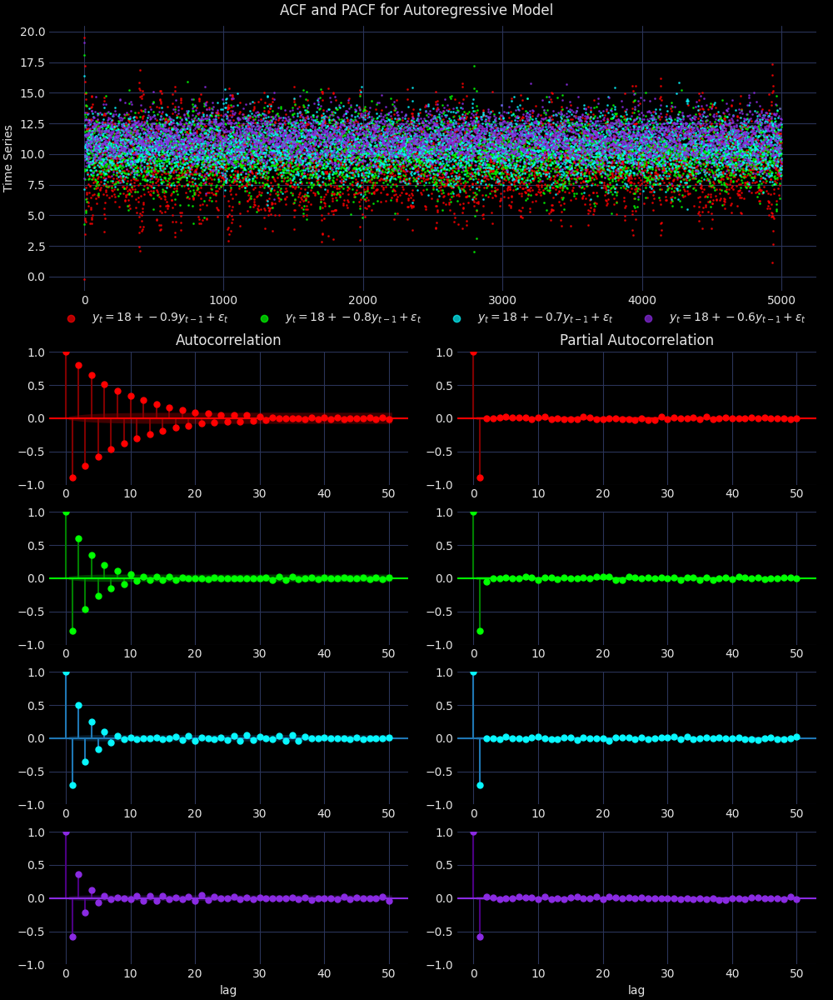
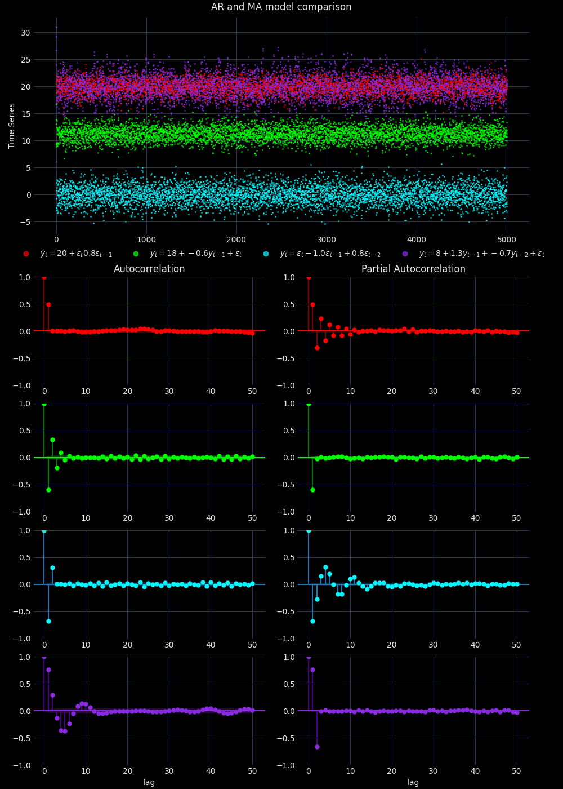
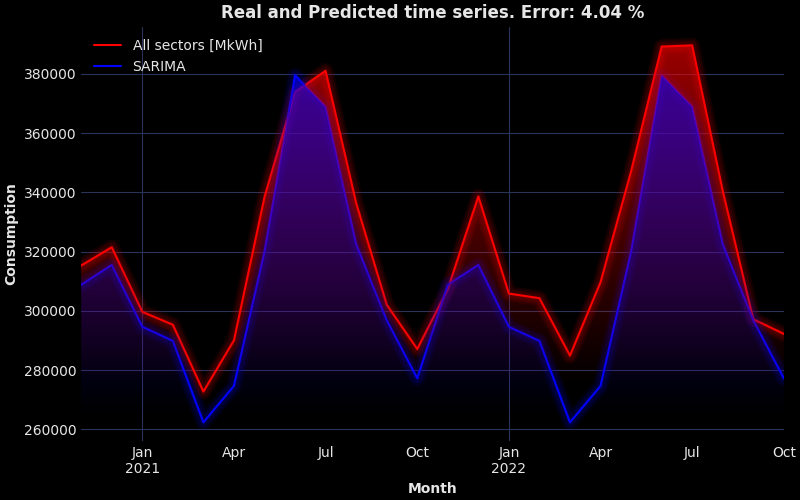

# Time Series Analysis

Repository contains projects from the lecture *Time Series Analysis* at my University. The goal is to learn and use methods for time series data prediction (mostly with *statsmodels* package in Python). All visualizations are created in *MatPlotLib*.

## Images

# Solar Activity Final Project

# Moving Average and Autoregressive models

# Predictions

    
    

    
    

# Analysis

    
    
    

